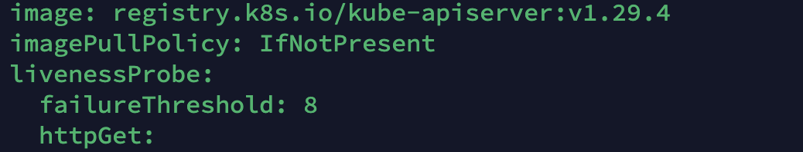
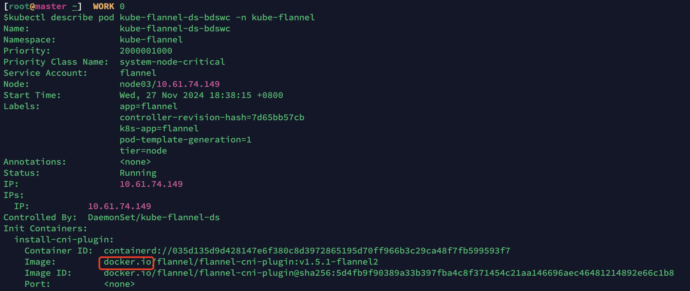
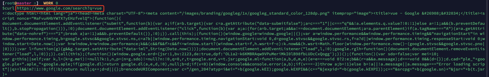

## 国内使用原生containerd 以及镜像仓库的解决方案

本解决方案，解决“根本问题”，尤其是在各种集群上面采用这套方案，方便快速。

优势：

- 部署方便，配置方便。
- 价格合适，尤其是代理方面，无需自建，（⚠️：不提供订阅地址，自己去获取）。
- 服务稳定

先看成果：

用原生仓库地址部署1.29版本的K8S

用原生镜像地址部署Pod

众所周知，国内想使用国外的镜像服务，需要通过各种加速链接来访问，但是这些连接容易造成不稳定的问题。

因此这个解决方案是解决“根本问题”，懂得都懂。

Google服务：

⚠️：只提供解决方案

需要者联系，www.jiufog.com，给我留言。